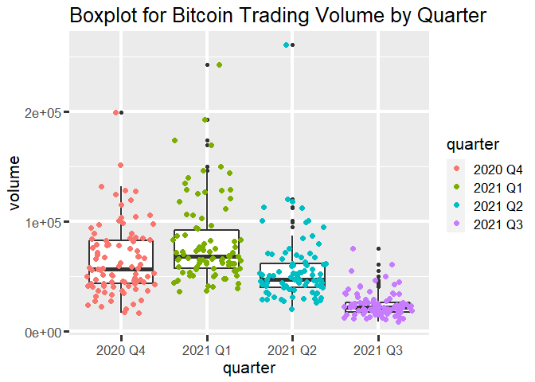

Interacting with Cryptocurrency API
================
Joey Chen
10/5/2021

  - [Introduction](#introduction)
  - [Requirements](#requirements)
      - [R Packages](#r-packages)
      - [API Key](#api-key)
  - [Functions to Interact with API](#functions-to-interact-with-api)
      - [(1) `getExchange`](#getexchange)
      - [(2) `getNews`](#getnews)
      - [(3) `getDailyMarket`](#getdailymarket)
      - [(4) `getTickerDetails`](#gettickerdetails)
      - [(5) `getPreviousClose`](#getpreviousclose)
      - [(6) `getAggregates`](#getaggregates)
      - [(7)\[Wrapper\] `cryptoAPI`](#wrapper-cryptoapi)
  - [Data Exploration](#data-exploration)
      - [Bitcoin Market Behavior](#bitcoin-market-behavior)
      - [Bitcoin vs Ethereum](#bitcoin-vs-ethereum)
  - [Conclusion](#conclusion)


# Introduction

Brief Intro Here…

# Requirements


### R Packages

The following packages are required to use the API function:

  - `tidyverse`: Useful data tools for transforming and visualizing data
  - `jsonlite`: Interact and download data with API
  - `knitr`: Display well-formatted tables
  - `lubridate`: Useful date functions

### API Key

You will also need an API key to be able to interact with the API.
Please go to [polygon.io](https://polygon.io/) to register for a free
API key. You will need to assign the key to the variable `APIkey`, as
follows:

``` r
APIkey = "insert_key_here"
```

# Functions to Interact with API

5 API Calls / Minute

## (1) `getExchange`

**Description:** Function to get Crypto Exchanges Data

**Input:** None

**Output:** Returns a table of exchange data information

``` r
getExchange <- function(){
  
   # Build the URL  
   baseURL <- "https://api.polygon.io/v1/meta/crypto-exchanges/"
   key <- paste0("?apiKey=", APIkey)
   URL <- paste0(baseURL, key)
   
   # Use the URL to retrieve data from API
   exchangeData <- fromJSON(URL)
   
   return(exchangeData)
}

# Sample Function Call
kable(getExchange())
```

| id | market | name     | url                             | tier   | locale |
| -: | :----- | :------- | :------------------------------ | :----- | :----- |
|  1 | crypto | Coinbase | <https://www.coinbase.com>      | crypto | G      |
|  2 | crypto | BITFINEX | <https://www.bitfinex.com/>     | crypto | G      |
|  6 | crypto | Bitstamp | <https://www.bitstamp.net/>’    | crypto | G      |
| 10 | crypto | HitBTC   | <https://hitbtc.com/>           | crypto | G      |
| 23 | crypto | Kraken   | <https://www.kraken.com/en-us/> | crypto | G      |

## (2) `getNews`

**Description:** Function to get Bitcoin news. It currently does not
work for any other cryptocurrencies.

**Input:** None

**Output:** Returns a table of Bitcoin news such as title, author, and
link.

``` r
getNews <- function(){
  
   # Build the URL  
   baseURL <- "https://api.polygon.io/v2/reference/news?limit=20&order=descending&sort=published_utc&ticker=BTC"
   key <- paste0("&apiKey=", APIkey)
   URL <- paste0(baseURL, key)
   
   # Use the URL to retrieve data from API
   newsList <- fromJSON(URL)
   newsData <- newsList$results %>% select(publisher, title, author, published_utc, article_url)
   
   return(newsData)
}

# Sample Function Call
kable(head(getNews(), n=3))
```

| publisher | title                                                                                   | author            | published\_utc       | article\_url                                                                                                                                            |
| :-------- | :-------------------------------------------------------------------------------------- | :---------------- | :------------------- | :------------------------------------------------------------------------------------------------------------------------------------------------------ |
| Benzinga  | Why You Shouldn’t Invest In Cryptocurrency, According To This Analyst                   | Adrian Zmudzinski | 2021-06-15T22:10:55Z | <https://www.benzinga.com/markets/cryptocurrency/21/06/21562733/why-you-shouldnt-invest-in-cryptocurrency-according-to-this-analyst>                    |
| Benzinga  | Billionaire Investor Tim Draper Still Believes Bitcoin Will Hit $250,000 By End Of 2022 | Adrian Zmudzinski | 2021-06-15T19:56:59Z | <https://www.benzinga.com/markets/cryptocurrency/21/06/21563347/billionaire-investor-tim-draper-still-believes-bitcoin-will-hit-250-000-by-end-of-2022> |
| Benzinga  | Two Former PayPal Execs Launch Crypto Payments Platform To Fight SWIFT Banking System   | Adrian Zmudzinski | 2021-06-15T16:56:30Z | <https://www.benzinga.com/markets/cryptocurrency/21/06/21570582/two-former-paypal-execs-launch-crypto-payments-platform-to-fight-swift-banking-system>  |

## (3) `getDailyMarket`

**Description:** Function to get the daily grouped data for the entire
Crypto market

**Input:** Date in “YYYY-MM-DD” format

**Output:** Returns a table of containing crypto market information for
the input date

``` r
getDailyMarket <- function(date=Sys.Date()){

   # Build the URL
   baseURL <- "https://api.polygon.io/v2/aggs/grouped/locale/global/market/crypto/"
   key <- paste0("?apiKey=", APIkey)
   day <- date
   URL <- paste0(baseURL, day, key)
   
   # Use the URL to retrieve data from API
   rawList <- fromJSON(URL)
   rawData <- rawList$results
   
   marketData <- rawData %>% select(ticker = T, volume = v, priceOpen = o, priceClose = c)
   
   return(marketData)
}

# Sample Function Call
kable(head(getDailyMarket("2021-09-30"), n=5))
```

| ticker    |       volume |   priceOpen |  priceClose |
| :-------- | -----------: | ----------: | ----------: |
| X:ICPUSD  |    539819.67 |    44.40000 |    45.08400 |
| X:LTCEUR  |     54319.85 |   124.85000 |   132.23000 |
| X:MANAUSD |   6227804.05 |     0.64500 |     0.68900 |
| X:IOTXUSD | 109464846.00 |     0.06025 |     0.06036 |
| X:BTCUSD  |     28947.92 | 41519.11000 | 43770.97000 |

## (4) `getTickerDetails`

**Description:** Function to get more information about the input ticker

**Input:** Ticker name. Examples: “BTCUSD” or “ETHUSD”

**Output:** Returns a table of ticker information such as currency
symbol and name

``` r
getTickerDetails <- function(ticker){

   # Build the URL  
   baseURL <- "https://api.polygon.io/vX/reference/tickers/"
   symbol <- paste0("X:", ticker)
   key <- paste0("?apiKey=", APIkey)
   URL <- paste0(baseURL, symbol, key)
   
   # Use the URL to retrieve data from API
   tickerList <- fromJSON(URL)
   tickerData <- as.data.frame(tickerList$results) %>% select(ticker, name, market, locale, currency_name, base_currency_symbol, base_currency_name)
   
   return(tickerData)
}

# Sample Function Call
kable(getTickerDetails("ETHUSD"))
```

| ticker   | name                            | market | locale | currency\_name       | base\_currency\_symbol | base\_currency\_name |
| :------- | :------------------------------ | :----- | :----- | :------------------- | :--------------------- | :------------------- |
| X:ETHUSD | Ethereum - United States Dollar | crypto | global | United States Dollar | ETH                    | Ethereum             |

## (5) `getPreviousClose`

**Description:** Function to get the previous day’s open, high, low, and
close for the input cryptocurrency

**Input:** Cryptocurrency pair ticker. Example: “BTCUSD” or “ETHUSD”

**Output:** Returns a table of containing previous day’s data

``` r
getPreviousClose <- function(ticker){
      
   baseURL <- "https://api.polygon.io/v2/aggs/ticker/"
   symbol <- paste0("X:", ticker, "/")
   otherSettings <- "prev?adjusted=true"
   key <- paste0("&apiKey=", APIkey)
   URL <- paste0(baseURL, symbol, otherSettings, key)
   
   # Use the URL to retrieve data from API
   prevCloseList <- fromJSON(URL)
   prevCloseData <- prevCloseList$results %>% select(ticker = T, volume = v, priceOpen = o, priceClose = c, priceLowest = l, priceHighest = h)

   return(prevCloseData)   
}

#Sample Function Call
kable(getPreviousClose("ETHUSD"))
```

| ticker   |   volume | priceOpen | priceClose | priceLowest | priceHighest |
| :------- | -------: | --------: | ---------: | ----------: | -----------: |
| X:ETHUSD | 232535.8 |    3311.2 |    3390.26 |      3258.9 |       3471.7 |

## (6) `getAggregates`

**Description:** Function to get 1-year aggregate data for a
cryptocurrency pair ending at a given date

**Input:** Date in “YYYY-MM-DD” format

**Output:** Returns a table of containing crypto market information such
as daily volume and price

``` r
getAggregates <- function(date=Sys.Date(), ticker){

   # Retrieve the date 1 year prior to the input date
   dayEnd <- as.Date(date)
   dayStart <- dayEnd - 364
   
   # Build the URL
   baseURL <- "https://api.polygon.io/v2/aggs/ticker/"
   symbol <- paste0("X:", ticker, "/")
   range <- "range/1/day/"
   otherSettings <- "?adjusted=true&sort=asc&limit=365"
   key <- paste0("&apiKey=", APIkey)
   URL <- paste0(baseURL, symbol, range, dayStart, "/", dayEnd, otherSettings, key)
   
   # Use the URL to retrieve data from API
   aggregateList <- fromJSON(URL)
   aggregateData <- aggregateList$results
   
   # Select Variables for the output dataset
   date_range <- as.Date(c(dayStart:dayEnd), origin = "1970-01-01")
   
   # Get the Quarter of the date
   qtr <- paste0(year(date_range), " Q", quarter(date_range))
   
   cryptoData <- data.frame(qtr, date_range, aggregateData$v, aggregateData$o, aggregateData$c)
   colnames(cryptoData) <- c("quarter", "date", "volume", "priceOpen", "priceClose")
   
   return(cryptoData)
}

kable(head(getAggregates("2021-09-30", ticker="BTCUSD"), n=5))
```

| quarter | date       |   volume | priceOpen | priceClose |
| :------ | :--------- | -------: | --------: | ---------: |
| 2020 Q4 | 2020-10-01 | 58731.65 |  10797.00 |   10616.10 |
| 2020 Q4 | 2020-10-02 | 61021.60 |  10616.35 |   10573.12 |
| 2020 Q4 | 2020-10-03 | 27705.14 |  10586.00 |   10551.65 |
| 2020 Q4 | 2020-10-04 | 23021.75 |  10550.32 |   10671.11 |
| 2020 Q4 | 2020-10-05 | 37483.09 |  10669.00 |   10799.00 |

## (7)\[Wrapper\] `cryptoAPI`

**Description:** Wrapper function to call any of the 6 functions above

**Input:** The `func` parameter can take either the function id (1-6) or
the function name (in quotes), Additional parameters needed for the
specific function can also be passed in

**Output:** Returns the output from the specific function called

``` r
cryptoAPI <- function(func, name="", ticker="", date=Sys.Date()){
   
   if (is.numeric(func)){
      if (!between(func, 1, 6)){
         stop("ERROR: There are only 6 functions. Please input a valid function ID (1 to 6)")
      } else{
        func <- switch(func,
                    "getExchange",
                    "getNews",
                    "getDailyMarket",
                    "getTickerDetails",
                    "getPreviousClose",
                    "getAggregates")
      } 
   }
   
   if (name != "" | ticker != ""){
   
      # Allow user to specify either the crypto currency name or the ticker name
      if (name != ""){
      symbol <- switch(toupper(name),
                       BITCOIN = "BTCUSD",
                       ETHEREUM = "ETHUSD",
                       CARDANO = "ADAUSD",
                       XRP = "XRPUSD",
                       SOLANA = "SOLUSD",
                       POLKADOT = "DOTUSD",
                       DOGECOIN = "DOGEUSD",
                       UNISWAP = "UNIUSD",
                       CHAINLINK = "LINKUSD",
                       LITECOIN = "LTCUSD",
                       )
      } else if (ticker != ""){
        symbol <- toupper(ticker)
      } else{
         stop("ERROR: Please input a valid cryptocurrency name or ticker")
      }
      

      if (symbol == ""){
         message <- paste("ERROR: Only the top 10 cryptocurrencies by market cap are supported,", 
                          "please input another name, or use the `ticker` and input a valid Crypto ticker")
         stop(message)
         
      }else if (!(paste0("X:", symbol) %in% getDailyMarket()$ticker)){
         message <- "ERROR: ticker not supported. Please input a valid ticker"
         
         stop(message)
      }
      
   }else if(name == "" & ticker == "" & func %in% c("getTickerDetails", "getPreviousClose", "getAggregates")){
      stop("ERROR: Missing cryptocurrency name or ticker input required for this function")
   }   
   
   
   # Function 1
   if (func == "getExchange"){
      output <- getExchange()
   
   # Function 2      
   }else if (func == "getNews"){
      output <- getNews()
      
   # Function 3   
   }else if (func == "getDailyMarket"){
      output <- getDailyMarket(date)
   
   # Function 4      
   }else if (func == "getTickerDetails"){
      output <- getTickerDetails(symbol)
   
   # Function 5   
   }else if (func == "getPreviousClose"){
      output <- getPreviousClose(symbol)
   
   # Function 6      
   }else if (func == "getAggregates"){
      output <- getAggregates(date, symbol)
      
   }else{
      stop("ERROR: The `func` argument is not valid")
   }
   
   return(output)
}
```

The following are examples of valid functions calls:

``` r
cryptoAPI(1)
cryptoAPI("getNews")
cryptoAPI(3)
cryptoAPI("getTickerDetails", name="cardano")
cryptoAPI(5, ticker="ethusd")
cryptoAPI(6, name="eThErEuM")
```

# Data Exploration

## Bitcoin Market Behavior

We can examine the Bitcoin trading Volume by looking at the Box plot.

``` r
ggplot(bitcoinData, aes(quarter, volume)) +
   geom_boxplot(size=1) +
   geom_jitter(aes(y=volume, fill=quarter, color=quarter), size=2) +
   labs(title="Boxplot for Bitcoin Trading Volume by Quarter") +
   theme(text=element_text(size=16), 
         panel.grid.major = element_line(size=1.5),
         axis.ticks = element_line(size=1.4),
         axis.ticks.length = unit(0.20, 'cm'))
```

<!-- -->

## Bitcoin vs Ethereum


Ethereum, the second largest cryptocurrency by market cap, is often
compared to Bitcoin. As of 2021-10-02, Bitcoin has a market cap of $900
million, while Ethereum has a market cap of $400 million. We can first
look at the performance of the two cryptocurrencies over the past year.

``` r
ethereumData <- cryptoAPI(6, name="Ethereum", date="2021-09-30")

calcPerformance <- function(price){

   change1Day <- scales::percent((price[365] - price[364]) / price[364], accuracy=0.1)
   change7Day <- scales::percent((price[365] - price[358]) / price[358], accuracy=0.1)
   change30Day <-scales::percent((price[365] - price[335]) / price[335], accuracy=0.1)
   changeYear <- scales::percent((price[365] - price[1]) / price[1], accuracy=0.1)
   
   scales::label_percent(c(change1Day, change7Day))
   
   performanceData <- cbind(price = price[365], '24h %' = change1Day, '7d %' = change7Day, '30d %' = change30Day, 'yr %' = changeYear)
   
   return(performanceData)
}

bitcoinPerformance <- cbind(cryptocurrency = "Bitcoin", calcPerformance(bitcoinData$priceClose))
ethereumPerformance <- cbind(cryptocurrency = "Ethereum", calcPerformance(ethereumData$priceClose))

kable(rbind(bitcoinPerformance, ethereumPerformance))
```

| cryptocurrency | price    | 24h % | 7d %   | 30d %   | yr %   |
| :------------- | :------- | :---- | :----- | :------ | :----- |
| Bitcoin        | 43770.97 | 5.4%  | \-2.5% | \-7.1%  | 312.3% |
| Ethereum       | 3000.28  | 5.3%  | \-4.9% | \-12.5% | 749.9% |

``` r
plot(x=bitcoinData$priceClose, y=ethereumData$priceClose)
```

<!-- -->

# Conclusion
